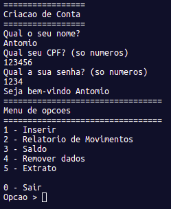
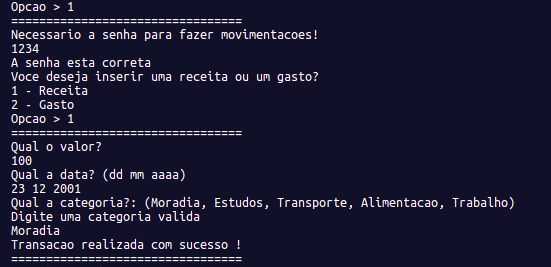
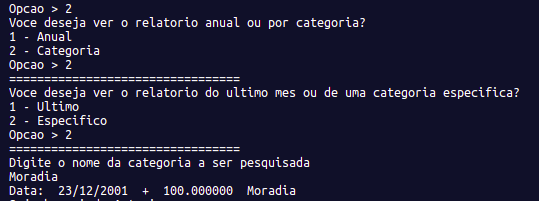
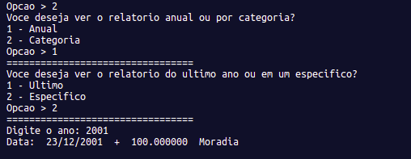
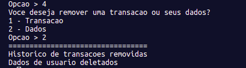
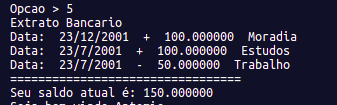

# Projeto Quem Poupa Tem

Projeto semestral para a matéria de Desenvolvimento de Algoritmos cursada no Centro Universitário FEI. Desenvolvimento de uma carteira de gastos pessoais em linguagem C e com armazenamento de informações em arquivo externo.

## Funcionalidade

Consiste num menu simples com 6 opções para o usuários:

```
1 - Inserir
2 - Relatorio de Movimentos
3 - Saldo
4 - Remover Dados 
5 - Extrato 

0 - Sair 
```

Assim que a aplicação se inicia é solicitado a criação do usuário. Sendo necessário inserir o nome, CPF e senha de sua carteira pessoal.




**Opção 1** - Essa opção permite a inserção de uma movimentação a conta, podendo ser uma receita ou gasto. Além do tipo de transção, deve-se inserir o valor, a data e a categoria de movimentação (dentro das opções definidas). Tais informações serão cadastradas na conta do usuário.



**Opção 2** - Essa opção exibe o relatório de movimentação da conta pessoal, podendo ser exibida de dois modos: Anual ou por categoria. A primeira exibe todas as movimentação do ano anterior ao recorrente ou de um ano especifico, enquanto a segunda solicita uma categoria ao usuário e exibe todas as movimentações referentes a essa categoria no último mês ou em um mês especifico. 




**Opção 3** - Essa opção exibe o saldo atual do usuário.


**Opção 4** - Essa opção pergunta ao usuário se ele deseja remover uma transação especifica de seu histórico ou se deseja remover todos os seus dados da aplicação.




**Opção 5** - Exibe o extrato de todas as movimentações bancárias.



**Opção 6** - Fecha a aplicação

## Execução

Tanto no Windows quanto no Linux a execução é feita a partir da execução das linhas a seguir no terminal, ou utilizando uma IDE de sua preferência. 

```bash
sudo apt-get install g++
g++ -o main source/*.c main.c
./main
```